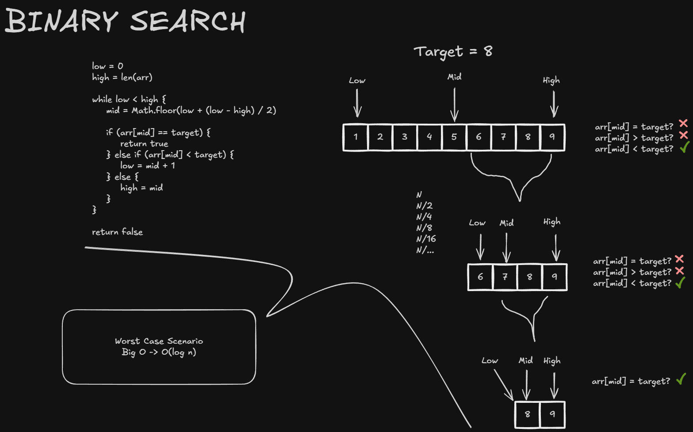

# Binary Search

Binary search is an efficient algorithm for finding a value in a **sorted** array.

Characteristics:
- Uses three positions as references: the beginning (`low`), the middle (`mid`), and the end (`high`);
- Compares the middle element with the target. If the target is smaller, the search continues in the left half; if it is larger, the search continues in the right half;
- Discards half of the remaining elements after each comparison;
- Can only be used with sorted arrays.

Its time complexity is **O(log n)** because each comparison reduces the search space by half. Therefore, the number of comparisons corresponds to the number of times `n` can be divided by `2` until only one element remains: `log₂(n)`.

General Illustration:



# Step-by-Step

## Initial State

- `target = 8`;
- `low = 0`, pointing to the value `1`;
- `high = 9`, pointing outside the array.

To follow the same execution shown in the general illustration, we will search for the value `8` in the following sorted array:


The indices start at `0`. In this implementation, `low` point to valid position to the array, meanwhile `high` point plus one outside of the array. Therefore, the initial value of `high` is `arr.length`, which is `9`.

## Algorithm Used

```typescript
function binarySearch(arr: number[], target: number): boolean {
    let low: number = 0;
    let high: number = arr.length;

    while (low < high) {
        const mid: number = Math.floor(low + (high - low) / 2);

        if (arr[mid] === target) {
            return true;
        } else if (arr[mid] < target) {
            low = mid + 1;
        } else {
            high = mid;
        }
    }

    return false;
}
```

When `arr[mid] < target`, the middle element can also be discarded, so `low` advances to `mid + 1`. When `arr[mid] > target`, `high` moves to `mid` because the middle element has already been checked and can be discarded as well.

The loop runs while `low < high`, meaning that the search interval still contains at least one valid position. If the loop ends without returning a result, the target is not in the array and the function returns `false`.

## 1st Iteration

First, the algorithm calculates the middle index:

```text
mid = floor(low + (high - low) / 2)
mid = floor(0 + (8 - 0) / 2)
mid = 4
```


The middle element is `arr[4] = 5`. Since `5 < 8`, the target can only be to the right of `mid`. The indices from `0` through `4` are discarded, and `low` is updated:

```text
low = mid + 1
low = 5
```


The new search interval contains `[6, 7, 8, 9]`, stored at indices `5` through `8`.

## 2nd Iteration

Now, `low = 5` and `high = 9`. The middle index is calculated again:

```text
mid = floor(low + (high - low) / 2)
mid = floor(5 + (8 - 5) / 2)
mid = floor(6.5)
mid = 6
```

The middle element is `arr[6] = 7`. Since `7 < 8`, the indices `5` and `6` are discarded, and `low` advances again:

```text
low = mid + 1
low = 7
```


The remaining search interval contains `[8, 9]`, stored at indices `7` and `8`.

## 3rd Iteration

With `low = 7` and `high = 9`, the middle index is calculated once more:

```text
mid = floor(low + (high - low) / 2)
mid = floor(7 + (8 - 7) / 2)
mid = floor(7.5)
mid = 7
```


Now, `arr[7] = 8`. Since the middle element is equal to the target, the search stops immediately and returns `true`.

## Execution Summary

| Iteration | `low` | `high` | `mid` | `arr[mid]` | Decision                    |
| --------- | ----: | -----: | ----: | ---------: | --------------------------- |
| 1         |     0 |      9 |     4 |          5 | `5 < 8`: move `low` to `5`  |
| 2         |     5 |      9 |     6 |          7 | `7 < 8`: move `low` to `7`  |
| 3         |     7 |      9 |     7 |          8 | Target found; return `true` |

The search space was reduced from `9` elements to `4`, and then to `2`:

```text
9 → 4 → 2
```

This reduction by half after each comparison is why binary search has a time complexity of **O(log n)**.
