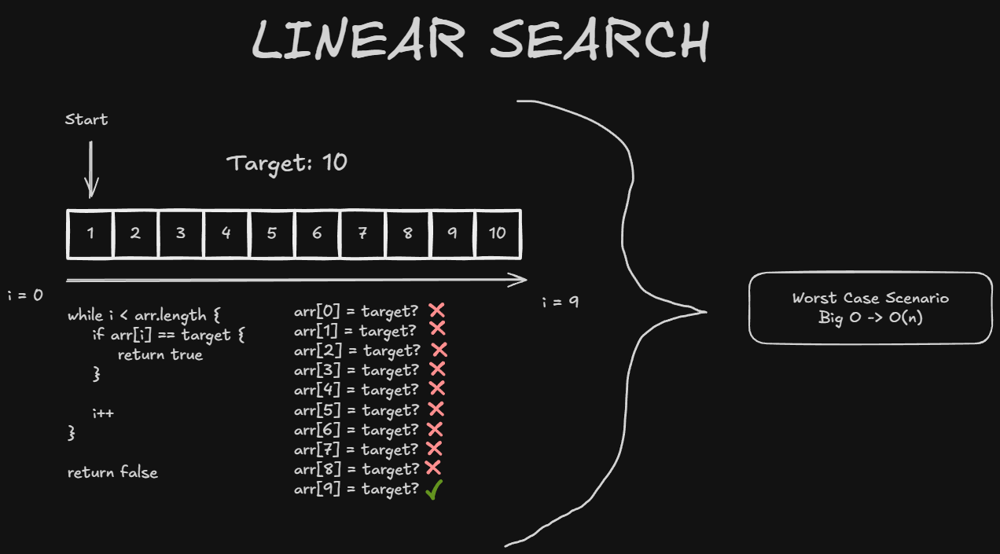
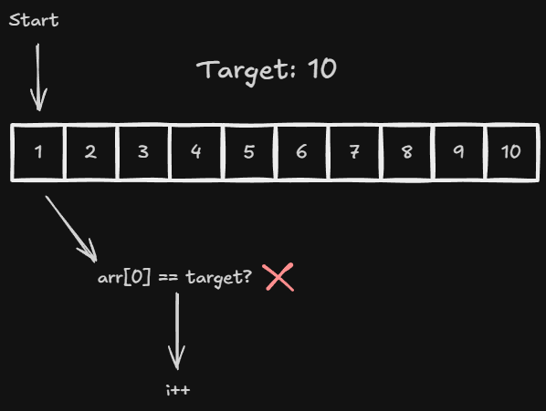
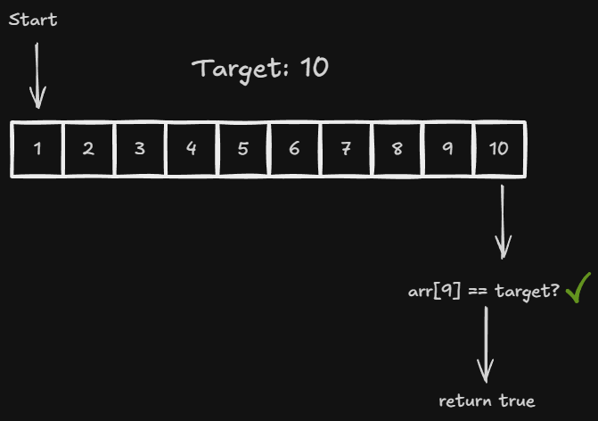

# Linear Search

Linear search is an algorithm that looks for a value in an array by comparing it with each element, from beginning to end. It works with both sorted and unsorted arrays.

Characteristics:
- Examines the elements one by one;
- Stops searching as soon as it finds the target;
- Its running time depends on the target's position;
- If the target does not exist or is in the last position, it examines the entire array.

Its time complexity is **O(n)** because, in the worst case, the algorithm must compare the target with all `n` elements in the array. Since the maximum number of comparisons grows at the same rate[...]

General Illustration:



# Step-by-Step

## Initial State

- `target = 10`;
- `i = 0`, pointing to the value `1`;
- The array contains `10` elements, stored at indices `0` through `9`.

To follow the same execution shown in the general illustration, we will search for the value `10` in the following array:


The indices start at `0`. The variable `i` indicates the position currently being checked and advances by one position after each comparison that does not find the target.

## Algorithm Used

```typescript
function linearSearch(arr: number[], target: number): boolean {
    let i: number = 0;

    while (i < arr.length) {
        if (arr[i] === target) {
            return true;
        }

        i++;
    }

    return false;
}
```

The loop runs while `i` refers to a valid position in the array. If `arr[i]` is equal to the target, the function returns `true` and stops the search immediately. Otherwise, `i` is incremented and[...]

If the loop ends without finding the target, every element has been compared; in that case, the function returns `false`.

## 1st Iteration

Initially, `i = 0`. The algorithm compares the first element with the target:

```text
arr[i] === target
arr[0] === 10
1 === 10 → false
```



Since the values are different, `i` is incremented:

```text
i++
i = 1
```

The search continues with the next element in the array.

## 2nd Through 9th Iterations

The same process is repeated for indices `1` through `8`, which store the values `2` through `9`. In each iteration, `arr[i]` is different from `10`, so the index advances again:

```text
2 !== 10
3 !== 10
4 !== 10
5 !== 10
6 !== 10
7 !== 10
8 !== 10
9 !== 10
```

After comparing the value `9`, the index is incremented to `i = 9`.

## 10th Iteration

Now, `i = 9`. The algorithm compares the last element in the array with the target:

```text
arr[i] === target
arr[9] === 10
10 === 10 → true
```



Since the values are equal, the target has been found. The function returns `true` and stops the search without incrementing `i` again.

## Execution Summary

| Iteration | `i`       | `arr[i]` | Comparison result        | Decision                              |
| --------- | --------: | -------: | ------------------------ | ------------------------------------- |
| 1         |         0 |        1 | `1 !== 10`               | Increment `i`                         |
| 2 through 9 |   1 to 8 |   2 to 9 | Element differs from `10` | Increment `i` after each comparison   |
| 10        |         9 |       10 | `10 === 10`              | Return `true`                         |

This example required **10 comparisons**. Since the target was in the last position, this execution represents the worst case for linear search. The same number of comparisons would be required i[...]

For an array with `n` elements, linear search may perform up to `n` comparisons:

```text
1 → 2 → 3 → ... → n
```

This growth in direct proportion to the input size is why linear search has a time complexity of **O(n)**.
