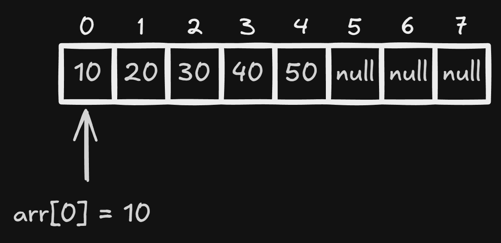
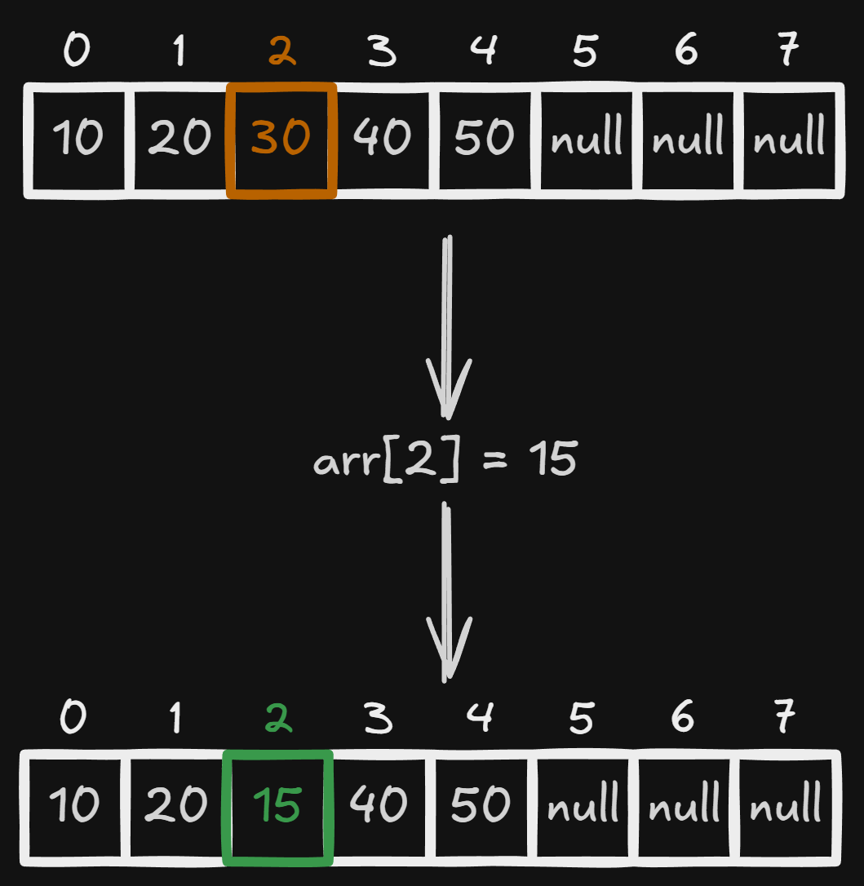
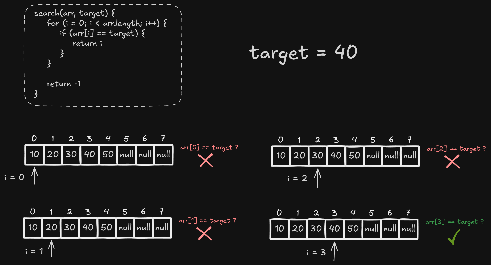

# Dynamic Arrays

A dynamic array is a data structure that stores elements in contiguous memory locations and can increase or decrease its capacity as the number of elements changes.

Like a static array, each element has an index, usually starting at `0`. The difference is that a dynamic array separately tracks the number of stored elements and the number of reserved positions.

Characteristics:

- Has a variable size;
- Stores elements of the same type;
- Uses contiguous memory locations;
- Allows access and updates by index in **O(1)**;
- Maintains additional capacity for new elements;
- Resizes when its capacity is exhausted;
- Can reduce its capacity when many positions become empty;
- May copy its elements to a new memory block during resizing.

Its main advantage is combining fast indexed access with the flexibility to grow. Its main limitation is the occasional cost of reallocating memory and copying elements.

# Array organization

## Indices and values

Consider a dynamic array containing five numbers with capacity for eight:


Indices `0` through `4` contain elements. Positions `5` through `7` are reserved but are not yet part of the array's logical size.

```text
array[0] → 10
array[2] → 30
array[4] → 50
```

For an array with size `size`, the occupied indices belong to the following range:

```text
0 to size - 1
```

In the example, `size = 5`. Therefore, the valid indices for access range from `0` to `4`, even though the capacity is `8`.

## Contiguous memory

The elements are stored next to each other in memory. If the array's initial address and the size of each element are known, the location of any element can be calculated directly:

```text
address(array[i]) = initialAddress + i × elementSize
```

This calculation does not depend on the number of elements. Therefore, accessing a position by index has **O(1)** complexity.

When the array needs to grow, there may be no free space immediately after the current block. In that case, the structure reserves a larger contiguous block, copies the elements, and releases the previous block.

## Size and capacity

A dynamic array maintains two different values:

- **Size (`size`)**: number of stored elements;
- **Capacity (`capacity`)**: total number of reserved positions.

```text
size = 5
capacity = 8

[10, 20, 30, 40, 50, null, null, null]
```

The size must never exceed the capacity:

```text
0 ≤ size ≤ capacity
```

The additional positions prevent a reallocation on every insertion. While `size < capacity`, a new element can be placed at the end immediately.

# Main operations

## Access by index

Access happens directly through the index:

```text
access(array, index) {
    if (index < 0 || index >= array.size) {
        throw "Invalid index"
    }

    return array.data[index]
}
```



Since the array does not need to be traversed, the complexity is **O(1)**.

## Update

Updating means replacing the value stored at an existing position:

```text
update(array, index, newValue) {
    if (index < 0 || index >= array.size) {
        throw "Invalid index"
    }

    array.data[index] = newValue
}
```



An update also has **O(1)** complexity because the position is accessed directly.

## Traversal and search

Traversal means visiting only the elements that are part of the array's logical size:

```text
traverse(array) {
    for (i = 0; i < array.size; i++) {
        visit(array.data[i])
    }
}
```

Because all `n` stored elements are visited, traversal has **O(n)** complexity.

When only the target value is known, it may be necessary to inspect the elements one by one:

```text
search(array, target) {
    for (i = 0; i < array.size; i++) {
        if (array.data[i] == target) {
            return i
        }
    }

    return -1
}
```



In the worst case, every element is examined. Therefore, a linear search in a dynamic array has **O(n)** complexity.

The fact that an array is dynamic does not automatically make searching fast. Access is **O(1)** only when the index is already known.

# Insertion

The insertion scenarios are shown below.

## Insertion at the end without resizing

When capacity is still available, the new value is stored in the first free position and the size is incremented:

```text
append(array, value) {
    if (array.size == array.capacity) {
        resize(array)
    }

    array.data[array.size] = value
    array.size++
}
```


Without resizing, insertion at the end has **O(1)** complexity.

## Growth and resizing

If `size == capacity`, there are no free positions. The structure must:

1. Define a larger capacity;
2. Reserve a new memory block;
3. Copy the elements to the new block;
4. Replace the reference to the old block;
5. Insert the new element.

A common strategy is to multiply the capacity by a factor, often `2`:

```text
resize(array) {
    if (array.capacity == 0) {
        newCapacity = 1
    } else {
        newCapacity = array.capacity × 2
    }

    newData = createArray(newCapacity)

    for (i = 0; i < array.size; i++) {
        newData[i] = array.data[i]
    }

    array.data = newData
    array.capacity = newCapacity
}
```


An individual resize has **O(n)** complexity because all elements must be copied. However, it does not happen on every insertion.

When capacity grows geometrically, the cost of copying is distributed across several insertions. Therefore, insertion at the end has **O(1) amortized** complexity, even though a particular insertion may cost **O(n)**.

## Insertion at the beginning or in the middle

To insert into an occupied position, the following elements must be shifted one position to the right:

```text
insert(array, index, value) {
    if (index < 0 || index > array.size) {
        throw "Invalid index"
    }

    if (array.size == array.capacity) {
        resize(array)
    }

    for (i = array.size; i > index; i--) {
        array.data[i] = array.data[i - 1]
    }

    array.data[index] = value
    array.size++
}
```

### Insertion at the beginning


### Insertion in the middle


In the worst case, all elements are shifted. Therefore, insertion at the beginning or in the middle has **O(n)** complexity.

# Removal

As with insertion, the removal scenarios are shown below.

## Removal from the end

Removing the last element only requires decreasing the logical size:

```text
removeLast(array) {
    if (array.size == 0) {
        throw "Empty array"
    }

    removedValue = array.data[array.size - 1]
    array.size--
    shrinkIfNeeded(array)

    return removedValue
}
```


Without reducing capacity, this operation has **O(1)** complexity. When a reduction is required, that specific removal costs **O(n)** because of the copy, but it remains **O(1) amortized** across several removals.

## Removal from the beginning or middle

When a position is removed, the following elements are shifted one position to the left to keep the array contiguous:

```text
remove(array, index) {
    if (index < 0 || index >= array.size) {
        throw "Invalid index"
    }

    removedValue = array.data[index]

    for (i = index; i < array.size - 1; i++) {
        array.data[i] = array.data[i + 1]
    }

    array.size--
    shrinkIfNeeded(array)
    return removedValue
}
```

### Removal from the beginning


### Removal from the middle


In the worst case, all following elements must be shifted. Therefore, removal from the beginning or middle has **O(n)** complexity.

## Capacity reduction

After a removal, the array reduces its capacity by half when **two conditions** are satisfied at the same time:

1. The size is less than or equal to one quarter of the capacity: `size ≤ capacity / 4`;
2. The current capacity is greater than the minimum capacity: `capacity > minimumCapacity`.

```text
shrinkIfNeeded(array) {
    if (
        array.size <= array.capacity / 4
        and array.capacity > array.minimumCapacity
    ) {
        newCapacity = max(
            array.minimumCapacity,
            array.capacity / 2
        )

        newData = createArray(newCapacity)

        for (i = 0; i < array.size; i++) {
            newData[i] = array.data[i]
        }

        array.data = newData
        array.capacity = newCapacity
    }
}
```


For example:

```text
size = 4
capacity = 16
minimumCapacity = 4

size ≤ capacity / 4        → 4 ≤ 4  → true
capacity > minimumCapacity → 16 > 4 → true

newCapacity = capacity / 2 → 8
```

The four elements are copied to a new array with capacity `8`. The capacity never becomes smaller than `minimumCapacity` or smaller than the number of stored elements.

The one-quarter threshold prevents repeated resizing. If capacity were reduced as soon as the array became half full, an alternating sequence of insertions and removals near that threshold could grow and shrink the array on every operation.

An individual reduction has **O(n)** complexity because the elements must be copied. Because it happens only after several removals, removal from the end still has **O(1) amortized** complexity.

# Operation complexity

| Operation                                 |          Complexity | Reason                                           |
| ----------------------------------------- | ------------------: | ------------------------------------------------ |
| Access by index                           |            **O(1)** | The position's address is calculated directly   |
| Update by index                           |            **O(1)** | The position is known                            |
| Traversal                                 |            **O(n)** | All elements are visited                         |
| Linear search                             |            **O(n)** | The entire array may need to be examined         |
| Insertion at the end without resizing     |            **O(1)** | The value occupies the next free position        |
| Insertion at the end                      | **O(1) amortized**   | **O(n)** resizes occur only occasionally         |
| Insertion at the beginning or middle      |            **O(n)** | Elements may need to be shifted                  |
| Removal from the end without shrinking    |            **O(1)** | Only the logical size is decreased               |
| Removal from the end                      | **O(1) amortized**   | **O(n)** reductions occur only occasionally      |
| Removal from the beginning or middle      |            **O(n)** | Elements may need to be shifted                  |
| Memory usage                              |            **O(n)** | Reserved memory grows with capacity              |

# Advantages and disadvantages

## Advantages

- Very fast access by index;
- Adjustable size during execution;
- Efficient insertion at the end on average;
- Good memory locality because elements are close together;
- Does not require knowing the final number of elements in advance;
- Suitable for lists that grow over time.

## Disadvantages

- May keep reserved positions unused;
- Resizing requires memory allocation and copying elements;
- Insertions and removals at the beginning or in the middle require shifting elements;
- References to internal positions may become invalid after reallocation;
- Requires a sufficiently large contiguous memory block when growing.

# When to use

Dynamic arrays are appropriate when:

- The number of elements may vary;
- Fast access by index is important;
- Insertions at the end are frequent;
- Insertions and removals at the beginning or in the middle are not predominant;
- Reserving some additional capacity is acceptable;
- The occasional cost of resizing is acceptable.

Common examples include:

- Lists of items added by the user;
- Query results with an unknown number of elements;
- Event histories;
- Collections used during data processing;
- Stack implementations;
- Structures such as `ArrayList`, `Vector`, `List`, and `slice`, depending on the language.
