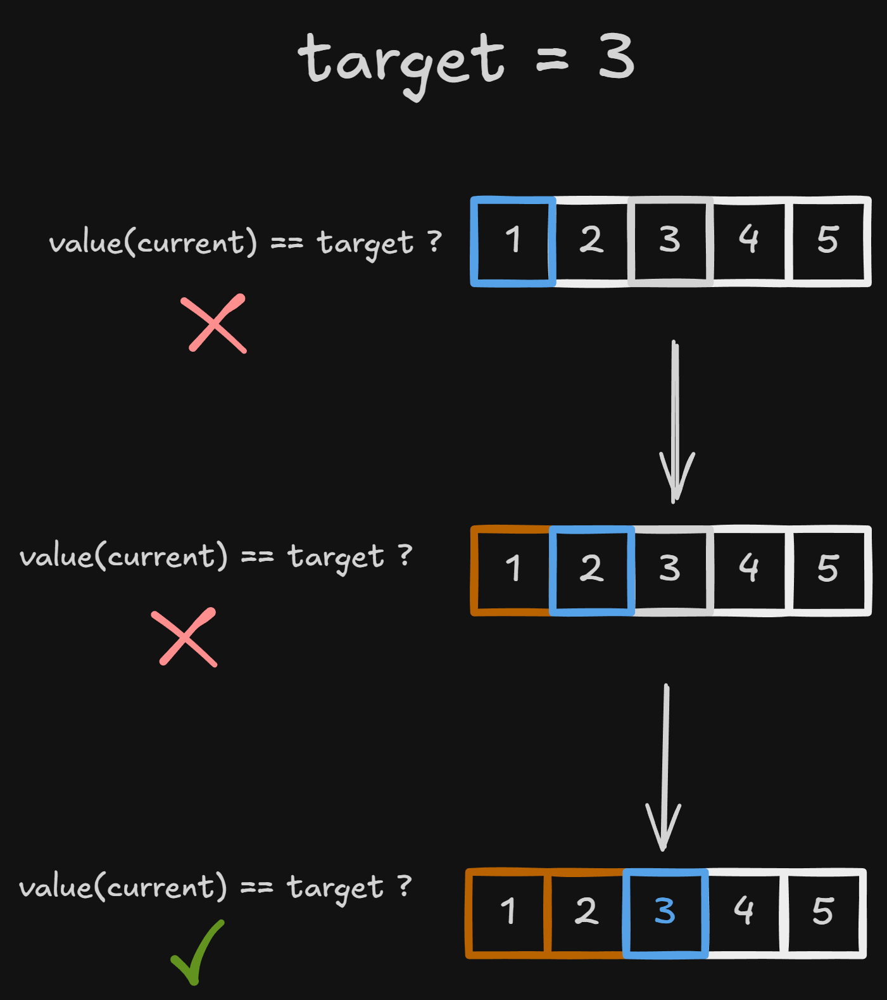

# Queues

A queue is a linear data structure that organizes elements according to the **FIFO** (*First In, First Out*) policy: the first element inserted is the first one removed.

Insertions take place at the **rear**, while the main removal and access operations take place at the **front**.

Characteristics:

- Inserts elements with the `enqueue` operation;
- Removes elements with the `dequeue` operation;
- Accesses the first element with `peek` or `front`;
- Preserves arrival order;
- Uses different ends for insertion and removal;
- Can be implemented in different ways without changing its FIFO behavior.

Its main advantage is processing elements in the same order in which they arrive. Its main limitation is restricting insertions and removals to specific ends.

# Queue organization

## Front and rear

A queue maintains two ends:

- `front`: identifies the first element, which will be accessed or removed;
- `rear`: identifies the end where a new element will be inserted.


The value `1` arrived first and will be removed first. The value `5` arrived last.

## Empty state

A queue is empty when it contains no elements:

```text
size = 0
```

In this state, `front` and `rear` do not identify valid elements. Their exact representation depends on the chosen implementation.

The `peek` and `dequeue` operations must check this state. Attempting to access or remove an element from an empty queue causes **underflow**.


## Logical behavior

This note uses the abstract operations `addLast` and `removeFirst` to represent the queue's ends. They do not determine whether the queue uses a circular array, a linked list, or another implementation.

A queue user interacts through `enqueue`, `dequeue`, and `peek` without needing to know the internal organization of its elements.


# Main operations

## Empty-state check

```text
isEmpty(queue) {
    return queue.size == 0
}
```

This operation has **O(1)** complexity.

## Number of elements

```text
getSize(queue) {
    return queue.size
}
```

Because the size is stored by the structure, retrieving it has **O(1)** complexity.

## First-element access

The `peek` operation returns the first element without removing it:

```text
peek(queue) {
    if (isEmpty(queue)) {
        throw "Empty queue"
    }

    return queue.firstElement
}
```


Because the front is known, this operation has **O(1)** complexity.


# Insertion

## Addition at the rear

The `enqueue` operation places a new element after the element currently at the rear:

```text
enqueue(queue, value) {
    queue.addLast(value)
    queue.size++
}
```


In an appropriate implementation, `enqueue` has **O(1)** complexity.


# Removal

## Removal from the front

The `dequeue` operation removes and returns the first element:

```text
dequeue(queue) {
    if (isEmpty(queue)) {
        throw "Empty queue"
    }

    removedValue = queue.firstElement
    queue.removeFirst()
    queue.size--

    return removedValue
}
```


In an appropriate implementation, `dequeue` has **O(1)** complexity.

When the only element is removed, the queue returns to the empty state, and neither end identifies an element.


# Traversal and search

Traversal and search do not change the queue's order. Elements are visited from the front to the rear:

```text
traverse(queue) {
    current = queue.front

    while (current != null) {
        visit(current)
        current = nextElement(current)
    }
}
```

A linear search follows arrival order:

```text
search(queue, target) {
    position = 0
    current = queue.front

    while (current != null) {
        if (value(current) == target) {
            return position
        }

        current = nextElement(current)
        position++
    }

    return -1
}
```



Traversal and search have **O(n)** complexity.


# Implementation options

FIFO behavior does not depend on how the elements are stored:

| Implementation | End representation                         | Note                                      |
| -------------- | ------------------------------------------ | ----------------------------------------- |
| Circular array | Indices for the front and rear             | Reuses released positions                 |
| Linked list    | References to the first and last nodes     | Connects and disconnects nodes at the ends |

Capacity, allocation, physical circularity, and resizing belong to the chosen implementation and not to the definition of a queue.

An appropriate implementation should avoid shifting every element after each `dequeue`. In a linked list, the front reference is updated. In an array, circular indices are normally used.


# Operation complexity

The following complexities represent a conventional implementation with direct access to both ends:

| Operation                  | Complexity                         | Reason                                                    |
| -------------------------- | ---------------------------------: | --------------------------------------------------------- |
| Check whether empty        |                         **O(1)**   | The state is known                                        |
| Get the size               |                         **O(1)**   | The size is stored                                        |
| Access the first element   |                         **O(1)**   | `front` is accessed directly                              |
| `enqueue`                  | **O(1)** or **amortized O(1)**    | Constant with a linked list and amortized with a dynamic array |
| `dequeue`                  |                         **O(1)**   | Updates the front directly                                |
| Traversal                  |                         **O(n)**   | Visits every element                                      |
| Linear search              |                         **O(n)**   | May examine every element                                 |
| Memory usage               |                         **O(n)**   | Grows with the number of elements                         |

With a dynamic-array implementation, `enqueue` may be **amortized O(1)**. This difference is an implementation detail, not a change in queue behavior.


# Advantages and disadvantages

## Advantages

- Preserves arrival order;
- Efficient insertion, removal, and access at the appropriate ends;
- Does not require searching for the next element to be removed;
- Suitable for organizing waiting and processing;
- Can be implemented in different ways.

## Disadvantages

- Only the first element has direct access through the queue interface;
- Searching for a value requires traversing the structure;
- Does not allow direct removal from the middle;
- FIFO order is unsuitable when newer or higher-priority items must be removed first.


# When to use

Queues are appropriate when:

- Elements must be processed in arrival order;
- Producers and consumers operate at different rates;
- Tasks must wait for processing;
- Events must be stored temporarily;
- An algorithm must explore states level by level.

Common examples include:

- Print queues;
- Task processing;
- Input and output buffers;
- Messaging systems;
- First-come, first-served systems;
- Simple process scheduling;
- Breadth-first search;
- Level-order tree traversal.
