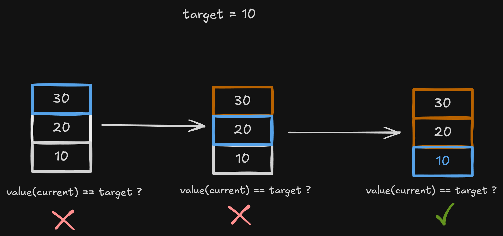

# Stacks

A stack is a linear data structure that organizes elements according to the **LIFO** (*Last In, First Out*) policy: the last element inserted is the first one removed.

The main insertion, removal, and access operations take place at a single end called the **top**.

Characteristics:

- Inserts elements with the `push` operation;
- Removes elements with the `pop` operation;
- Accesses the top with `peek` or `top`;
- Provides direct access only to the top element;
- Keeps the oldest element near the base;
- Can be implemented in different ways without changing its LIFO behavior.

Its main advantage is performing insertions and removals at the top efficiently. Its main limitation is providing direct access to only one element at a time.

# Stack organization

## Base and top

Consider the following stack:


The value `30` is at the top and will be removed first. The value `10` is at the base and can only be removed after the elements above it.

## Empty state

A stack is empty when it contains no elements:

```text
size = 0
top = null
```

The `peek` and `pop` operations must check this state. Attempting to access or remove an element from an empty stack causes **underflow**.


## Logical behavior

In this example, the abstract operations `addLast` and `removeLast` are used only to represent the end that acts as the top. They do not determine whether the stack uses an array, a linked list, or another implementation.

A stack user interacts through `push`, `pop`, and `peek` without needing to know its internal organization.


# Main operations

## Empty-state check

```text
isEmpty(stack) {
    return stack.size == 0
}
```

This operation has **O(1)** complexity.

## Number of elements

```text
getSize(stack) {
    return stack.size
}
```

Because the size is stored by the structure, retrieving it has **O(1)** complexity.

## Top access

The `peek` operation returns the top element without removing it:

```text
peek(stack) {
    if (isEmpty(stack)) {
        throw "Empty stack"
    }

    return stack.lastElement
}
```


Because the top is known, this operation has **O(1)** complexity.


# Insertion

## Addition at the top

The `push` operation places the new element above the current top:

```text
push(stack, value) {
    stack.addLast(value)
    stack.size++
}
```


In an appropriate implementation, `push` has **O(1)** complexity. When the stack uses a dynamic array, its cost may be **amortized O(1)** because of internal memory-management details.


# Removal

## Removal from the top

The `pop` operation removes and returns the element at the top:

```text
pop(stack) {
    if (isEmpty(stack)) {
        throw "Empty stack"
    }

    removedValue = stack.lastElement
    stack.removeLast()
    stack.size--

    return removedValue
}
```


In an appropriate implementation, `pop` has **O(1)** complexity.


# Traversal and search

Traversal and search are not among the three essential stack operations, but some implementations may provide them.

A traversal from the top to the base visits elements in the order in which they would be removed:

```text
traverseFromTop(stack) {
    current = stack.top

    while (current != null) {
        visit(current)
        current = elementBelow(current)
    }
}
```

A linear search follows the same direction:

```text
search(stack, target) {
    position = 0
    current = stack.top

    while (current != null) {
        if (value(current) == target) {
            return position
        }

        current = elementBelow(current)
        position++
    }

    return -1
}
```



Traversal and search have **O(n)** complexity.


# Implementation options

LIFO behavior does not depend on how the elements are stored:

| Implementation | Top representation      | Note                                      |
| -------------- | ----------------------- | ----------------------------------------- |
| Array          | Last occupied position  | Elements occupy contiguous positions      |
| Linked list    | First node              | Each node points to the element below it  |

Capacity, allocation, and resizing belong to the chosen implementation.


# Operation complexity

The following complexities represent a conventional implementation that maintains direct access to the top:

| Operation            | Complexity                         | Reason                                                    |
| -------------------- | ---------------------------------: | --------------------------------------------------------- |
| Check whether empty  |                         **O(1)**   | The state is known                                        |
| Get the size         |                         **O(1)**   | The size is stored                                        |
| Access the top       |                         **O(1)**   | The top is accessed directly                              |
| `push`               | **O(1)** or **amortized O(1)**    | Constant with a linked list and amortized with a dynamic array |
| `pop`                |                         **O(1)**   | Removes the top directly                                  |
| Traversal            |                         **O(n)**   | Visits every element                                      |
| Linear search        |                         **O(n)**   | May examine every element                                 |
| Memory usage         |                         **O(n)**   | Grows with the number of elements                         |

With a dynamic-array implementation, `push` may be **amortized O(1)**. This difference is an implementation detail, not a change in stack behavior.


# Advantages and disadvantages

## Advantages

- Efficient insertion, removal, and access at the top;
- Simple and predictable access rules;
- Suitable for controlling nested operations;
- Makes reverse-order processing easier;
- Can be implemented in different ways.

## Disadvantages

- Only the top element has direct access;
- Searching for a value requires traversing the structure;
- Does not allow direct removal from the base or middle;
- LIFO order is unsuitable when elements must be handled in arrival order.


# When to use

Stacks are appropriate when:

- The most recent item must be processed first;
- Operations must be undone in reverse order;
- Nested calls or states must be controlled;
- A sequence must be reversed;
- Delimiters and expressions must be validated.

Common examples include:

- Function call stacks;
- Undo and redo history;
- Navigation between pages or screens;
- Expression evaluation and conversion;
- Validation of parentheses and other delimiters;
- Depth-first search algorithms;
- Iterative implementations of recursion.
